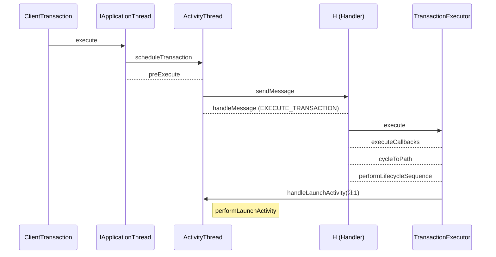
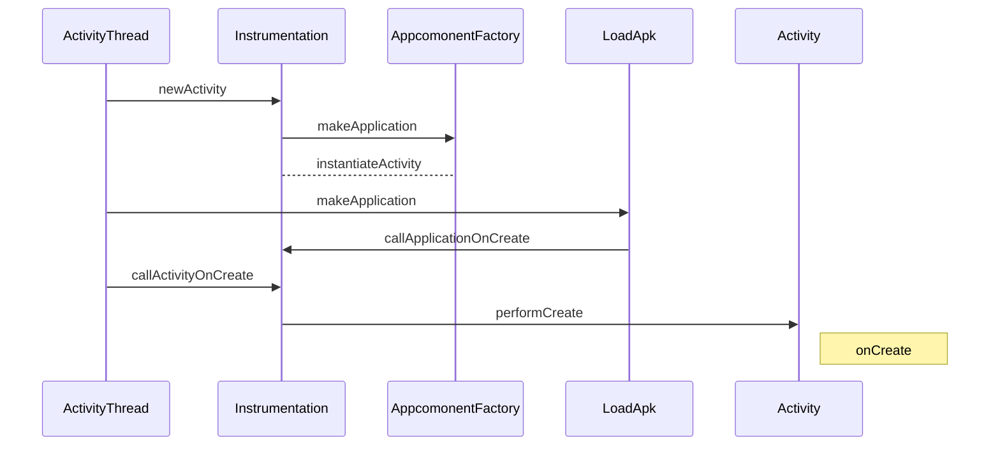
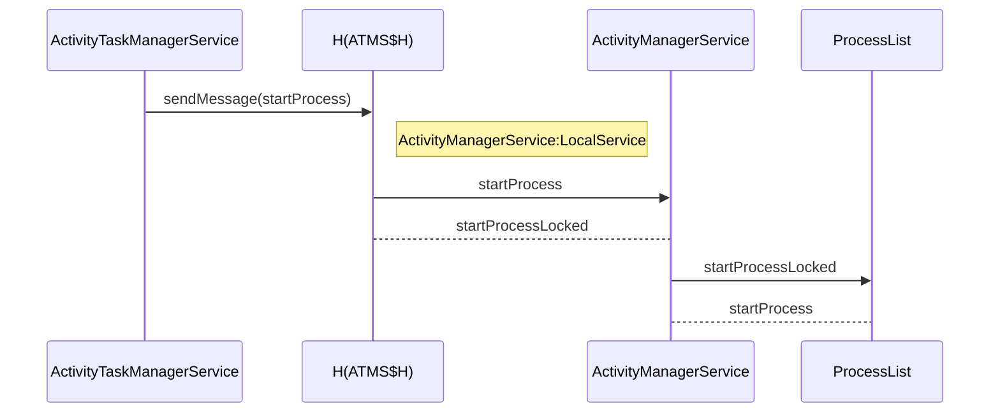
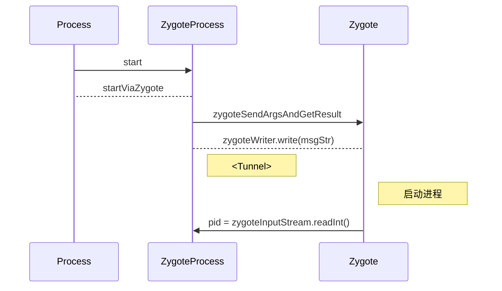

# Activity启动流程

## startAcitityForResult
Launch an activity for which you would like a result when it finished. When this activity exits, your onActivityResult() method will be called with the given requestCode. Using a negative requestCode is the same as calling startActivity (the activity is not launched as a sub-activity).
Note that this method should only be used with Intent protocols that are defined to return a result. In other protocols (such as Intent.ACTION_MAIN or Intent.ACTION_VIEW), you may not get the result when you expect. For example, if the activity you are launching uses Intent.FLAG_ACTIVITY_NEW_TASK, it will not run in your task and thus you will immediately receive a cancel result.
As a special case, if you call startActivityForResult() with a requestCode >= 0 during the initial onCreate(Bundle savedInstanceState)/onResume() of your activity, then your window will not be displayed until a result is returned back from the started activity. This is to avoid visible flickering when redirecting to another activity.
This method throws android.content.ActivityNotFoundException if there was no Activity found to run the given Intent.

```java
public void startActivityForResult(@RequiresPermission Intent intent, int requestCode, @Nullable Bundle options) {
    if (mParent == null) {
        options = transferSpringboardActivityOptions(options);
        Instrumentation.ActivityResult ar =
            mInstrumentation.execStartActivity(
                this, mMainThread.getApplicationThread(), mToken, this,
                intent, requestCode, options);
        if (ar != null) {
            mMainThread.sendActivityResult(
                mToken, mEmbeddedID, requestCode, ar.getResultCode(),
                ar.getResultData());
        }
        if (requestCode >= 0) {
            // If this start is requesting a result, we can avoid making
            // the activity visible until the result is received.  Setting
            // this code during onCreate(Bundle savedInstanceState) or onResume() will keep the
            // activity hidden during this time, to avoid flickering.
            // This can only be done when a result is requested because
            // that guarantees we will get information back when the
            // activity is finished, no matter what happens to it.
            mStartedActivity = true;
        }

        cancelInputsAndStartExitTransition(options);
    } else {
        ...
    }
```

## Instrumentation.execStartActivity
Execute a startActivity call made by the application. The default implementation takes care of updating any active Instrumentation.ActivityMonitor objects and dispatches this call to the system activity manager; you can override this to watch for the application to start an activity, and modify what happens when it does.
This method returns an Instrumentation.ActivityResult object, which you can use when intercepting application calls to avoid performing the start activity action but still return the result the application is expecting. To do this, override this method to catch the call to start activity so that it returns a new ActivityResult containing the results you would like the application to see, and don't call up to the super class. Note that an application is only expecting a result if requestCode is >= 0.
This method throws ActivityNotFoundException if there was no Activity found to run the given Intent.
```java
public ActivityResult execStartActivity(
            Context who, IBinder contextThread, IBinder token, Activity target,
            Intent intent, int requestCode, Bundle options) {
    ...
    try {
        intent.migrateExtraStreamToClipData(who);
        intent.prepareToLeaveProcess(who);
        int result = ActivityTaskManager.getService().startActivity(whoThread,
                who.getOpPackageName(), who.getAttributionTag(), intent,
                intent.resolveTypeIfNeeded(who.getContentResolver()), token,
                target != null ? target.mEmbeddedID : null, requestCode, 0, null, options);
        // 检查启动结果，如果无法正确启动Activity，就会抛出异常信息
        // 比如Unable to find explicit activity class; have you declared this activity in your AndroidManifest.xml?
        checkStartActivityResult(result, intent);
    } catch (RemoteException e) {
        throw new RuntimeException("Failure from system", e);
    }
    return null;
}
```

## ActivityTaskManager.getService().startActivity,此处开始就是IPC调用了，需要在另一端查看对应源码，即ActivityTaskManagerService.startActivity
```java
@Override
    public final int startActivity(IApplicationThread caller, String callingPackage,
            String callingFeatureId, Intent intent, String resolvedType, IBinder resultTo,
            String resultWho, int requestCode, int startFlags, ProfilerInfo profilerInfo,
            Bundle bOptions) {
    return startActivityAsUser(caller, callingPackage, callingFeatureId, intent, resolvedType,
            resultTo, resultWho, requestCode, startFlags, profilerInfo, bOptions,
            UserHandle.getCallingUserId());
}

private int startActivityAsUser(IApplicationThread caller, String callingPackage,
        @Nullable String callingFeatureId, Intent intent, String resolvedType,
        IBinder resultTo, String resultWho, int requestCode, int startFlags,
        ProfilerInfo profilerInfo, Bundle bOptions, int userId, boolean validateIncomingUser) {
    assertPackageMatchesCallingUid(callingPackage);
    enforceNotIsolatedCaller("startActivityAsUser");

    userId = getActivityStartController().checkTargetUser(userId, validateIncomingUser,
            Binder.getCallingPid(), Binder.getCallingUid(), "startActivityAsUser");

    // TODO: Switch to user app stacks here.
    return getActivityStartController().obtainStarter(intent, "startActivityAsUser")
            .setCaller(caller)
            .setCallingPackage(callingPackage)
            .setCallingFeatureId(callingFeatureId)
            .setResolvedType(resolvedType)
            .setResultTo(resultTo)
            .setResultWho(resultWho)
            .setRequestCode(requestCode)
            .setStartFlags(startFlags)
            .setProfilerInfo(profilerInfo)
            .setActivityOptions(bOptions)
            .setUserId(userId)
            .execute();

}
```

## ActivityStarter.obtainStarter
A starter to configure and execute starting an activity. It is valid until after ActivityStarter.execute is invoked. At that point, the starter should be considered invalid and no longer modified or used.
```java
ActivityStarter obtainStarter(Intent intent, String reason) {
    return mFactory.obtain().setIntent(intent).setReason(reason);
}
```
Controller for interpreting how and then launching an activity. This class collects all the logic for determining how an intent and flags should be turned into an activity and associated task and root task.
```java
class ActivityStarter
```

## ActivityStarter.execute()
Resolve necessary information according the request parameters provided earlier, and execute the request which begin the journey of starting an activity.
Returns:
The starter result.
```java
int execute() {
    try {
        ...
        final LaunchingState launchingState;
        synchronized (mService.mGlobalLock) {
            final ActivityRecord caller = ActivityRecord.forTokenLocked(mRequest.resultTo);
            final int callingUid = mRequest.realCallingUid == Request.DEFAULT_REAL_CALLING_UID
                    ?  Binder.getCallingUid() : mRequest.realCallingUid;
            launchingState = mSupervisor.getActivityMetricsLogger().notifyActivityLaunching(
                    mRequest.intent, caller, callingUid);
        }
        ...
        int res;
        synchronized (mService.mGlobalLock) {
            ...
            res = executeRequest(mRequest);
            ...
            // Notify ActivityMetricsLogger that the activity has launched.
            // ActivityMetricsLogger will then wait for the windows to be drawn and populate
            // WaitResult.
            mSupervisor.getActivityMetricsLogger().notifyActivityLaunched(launchingState, res,
                    newActivityCreated, mLastStartActivityRecord, originalOptions);
            if (mRequest.waitResult != null) {
                mRequest.waitResult.result = res;
                res = waitResultIfNeeded(mRequest.waitResult, mLastStartActivityRecord,
                        launchingState);
            }
            return getExternalResult(res);
        }
    } finally {
        // Called when execution is complete. Sets state indicating completion and proceeds with recycling if appropriate.
        onExecutionComplete();
    }
}
```
Executing activity start request and starts the journey of starting an activity. Here begins with performing several preliminary checks. The normally activity launch flow will go through startActivityUnchecked to startActivityInner.
```java
private int executeRequest(Request request) {
    ...
    mLastStartActivityResult = startActivityUnchecked(r, sourceRecord, voiceSession,
            request.voiceInteractor, startFlags, true /* doResume */, checkedOptions, inTask,
            restrictedBgActivity, intentGrants);
    ...
    return mLastStartActivityResult;
}
```
Start an activity while most of preliminary checks has been done and caller has been confirmed that holds necessary permissions to do so. Here also ensures that the starting activity is removed if the start wasn't successful.
```java
private int startActivityUnchecked(final ActivityRecord r, ActivityRecord sourceRecord,
            IVoiceInteractionSession voiceSession, IVoiceInteractor voiceInteractor,
            int startFlags, boolean doResume, ActivityOptions options, Task inTask,
            boolean restrictedBgActivity, NeededUriGrants intentGrants) {
    ...
    try {
        ...
        result = startActivityInner(r, sourceRecord, voiceSession, voiceInteractor,
                startFlags, doResume, options, inTask, restrictedBgActivity, intentGrants);
    } finally {
        ...
    }

    ...

    return result;
}
```
Start an activity and determine if the activity should be adding to the top of an existing task or delivered new intent to an existing activity. Also manipulating the activity task onto requested or valid root-task/display. Note: This method should only be called from startActivityUnchecked.
```java
int startActivityInner(final ActivityRecord r, ActivityRecord sourceRecord,
    IVoiceInteractionSession voiceSession, IVoiceInteractor voiceInteractor,
    int startFlags, boolean doResume, ActivityOptions options, Task inTask,
    boolean restrictedBgActivity, NeededUriGrants intentGrants) {
    ...
    // 方法的主要作用是判断当前 activity 是否可见以及是否需要为其新建 Task，根据不同情况将 ActivityRecord 加入到对应的 Task 栈顶中
    mTargetRootTask.startActivityLocked(mStartActivity,
        topRootTask != null ? topRootTask.getTopNonFinishingActivity() : null, newTask,
        mKeepCurTransition, mOptions, sourceRecord);
    ...
    // 将所有聚焦的 Task 的所有 Activity 恢复运行，因为有些刚加入的 Activity 是处于暂停状态的
    // 最终都会走该方法
    mRootWindowContainer.resumeFocusedTasksTopActivities();
    ...
    return START_SUCCESS;
}
```
## RootWindowContainer.resumeFocusedTasksTopActivities
```java
boolean resumeFocusedTasksTopActivities(
        Task targetRootTask, ActivityRecord target, ActivityOptions targetOptions,
        boolean deferPause) {
    ...
    if (targetRootTask != null && (targetRootTask.isTopRootTaskInDisplayArea()
            || getTopDisplayFocusedRootTask() == targetRootTask)) {
        result = targetRootTask.resumeTopActivityUncheckedLocked(target, targetOptions,
                deferPause);
    }
    ...
}
```

## Task.resumeTopActivityUncheckedLocked
Ensure that the top activity in the root task is resumed.
Params:
prev – The previously resumed activity, for when in the process of pausing; can be null to call from elsewhere.
options – Activity options.
deferPause – When true, this will not pause back tasks.
Returns:
Returns true if something is being resumed, or false if nothing happened. NOTE: It is not safe to call this method directly as it can cause an activity in a non-focused root task to be resumed. Use RootWindowContainer.resumeFocusedTasksTopActivities to resume the right activity for the current system state.
```java
boolean resumeTopActivityUncheckedLocked(ActivityRecord prev, ActivityOptions options,
        boolean deferPause) {
    ...
    try {
        ...

        if (isLeafTask()) {
            if (isFocusableAndVisible()) {
                someActivityResumed = resumeTopActivityInnerLocked(prev, options, deferPause);
            }
        } else {
            ...
        }

        ...
    } finally {
        ...
    }

    ...
}
```

```java
@GuardedBy("mService")
private boolean resumeTopActivityInnerLocked(ActivityRecord prev, ActivityOptions options) {
    ActivityRecord next = topRunningActivity(true /* focusableOnly */);
    // ...
    if (next.attachedToProcess()) {
        // Activity 已经附加到进程，恢复页面并更新栈
    } else {
        // Whoops, need to restart this activity!
                    mTaskSupervisor.startSpecificActivity(next, true, true);
    }
}
```

## ActivityTaskSupervisor.startSpecificActivity

```java
// TODO: This class has become a dumping ground. Let's
// - Move things relating to the hierarchy to RootWindowContainer
// - Move things relating to activity life cycles to maybe a new class called ActivityLifeCycler
// - Move interface things to ActivityTaskManagerService.
// - All other little things to other files.
class ActivityTaskSupervisor {}

void startSpecificActivity(ActivityRecord r, boolean andResume, boolean checkConfig) {
    // Is this activity's application already running?
    final WindowProcessController wpc =
            mService.getProcessController(r.processName, r.info.applicationInfo.uid);

    boolean knownToBeDead = false;
    if (wpc != null && wpc.hasThread()) {
        try {
            realStartActivityLocked(r, wpc, andResume, checkConfig);
            return;
        } catch (RemoteException e) {
            Slog.w(TAG, "Exception when starting activity "
                    + r.intent.getComponent().flattenToShortString(), e);
        }

        // If a dead object exception was thrown -- fall through to
        // restart the application.
        knownToBeDead = true;
    }

    r.notifyUnknownVisibilityLaunchedForKeyguardTransition();

    final boolean isTop = andResume && r.isTopRunningActivity();
    mService.startProcessAsync(r, knownToBeDead, isTop, isTop ? "top-activity" : "activity");
}
```

### 如果进程已经存在，走realStartActivityLocked
```java
boolean realStartActivityLocked(ActivityRecord r, WindowProcessController proc,
            boolean andResume, boolean checkConfig) throws RemoteException {
    // Create activity launch transaction.
    final ClientTransaction clientTransaction = ClientTransaction.obtain(
        proc.getThread(), r.appToken);

    final ActivityLifecycleItem lifecycleItem;
    if (andResume) {
        lifecycleItem = ResumeActivityItem.obtain(mService.isNextTransitionForward());
    } else {
        lifecycleItem = PauseActivityItem.obtain();
    }
    clientTransaction.setLifecycleStateRequest(lifecycleItem);

    // Schedule transaction.
    mService.getLifecycleManager().scheduleTransaction(clientTransaction);
}
```
#### Transaction
事务(Transaction)是包含一系列消息的容器，这些消息最终可能会传送到客户端中。其中包含一组回调以及最终的生命周期状态。setLifecycleStateRequest 用于指定客户端的终态，即事务执行完毕后客户端应当处于的最终状态，其参数类型是 ActivityLifecycleItem，可以理解为发送给客户端的请求。

<br/>
这里的 mService 是 ActivityTaskManagerService，是一个主要用于管理 activity 及其容器(task、display 等)的系统服务；getLifecycleManager 返回 ClientLifecycleManager。但这都不重要，因为最终也只是执行了 transaction.schedule() 开始调度事务，主要按照以下顺序执行:

1. 客户端调用 preExecute，触发所有需要在真正调度事务前执行完毕的工作；
2. 发送事务的 message 信息到客户端；
3. 客户端调用 TransactionExecutor.execute，执行所有回调以及必要的生命周期事务；

```java
public void schedule() throws RemoteException {
	mClient.scheduleTransaction(this);
}
```
mClient 为 IApplicationThread 类型，这是个抽象接口，同时也是远程调用接口，其 AIDL 定义在: frameworks/base/core/java/android/app/IApplicationThread.aidl 文件中。因此，最终的调用又会回到 RPC 的实现端，即应用程序所在的客户端，实现类为 ActivityThread。其中通过异步的 Handler 分发和调度事件，最终在 执行线程(主线程)的 handleMessage 回调中执行服务端传过来的 Transaction。



值得一提的是，TransactionExecutor 中执行了 mTransactionHandler.handleLaunchActivity，而 mTransactionHandler 是在 TransactionExecutor 的构造函数中传入的，构造正是在 ActivityThread 中:
```java
class TransactionExecutor {
    
    /** Transition the client through previously initialized state sequence. */
    private void performLifecycleSequence(ActivityClientRecord r, IntArray path,
            ClientTransaction transaction) {
        final int size = path.size();
        for (int i = 0, state; i < size; i++) {
            state = path.get(i);
            if (DEBUG_RESOLVER) {
                Slog.d(TAG, tId(transaction) + "Transitioning activity: "
                        + getShortActivityName(r.token, mTransactionHandler)
                        + " to state: " + getStateName(state));
            }
            switch (state) {
                case ON_CREATE:
                    mTransactionHandler.handleLaunchActivity(r, mPendingActions,
                            null /* customIntent */);
                    break;
                case ON_START:
                    mTransactionHandler.handleStartActivity(r, mPendingActions,
                            null /* activityOptions */);
                    break;
                case ON_RESUME:
                    mTransactionHandler.handleResumeActivity(r, false /* finalStateRequest */,
                            r.isForward, "LIFECYCLER_RESUME_ACTIVITY");
                    break;
                case ON_PAUSE:
                    mTransactionHandler.handlePauseActivity(r, false /* finished */,
                            false /* userLeaving */, 0 /* configChanges */, mPendingActions,
                            "LIFECYCLER_PAUSE_ACTIVITY");
                    break;
                case ON_STOP:
                    mTransactionHandler.handleStopActivity(r, 0 /* configChanges */,
                            mPendingActions, false /* finalStateRequest */,
                            "LIFECYCLER_STOP_ACTIVITY");
                    break;
                case ON_DESTROY:
                    mTransactionHandler.handleDestroyActivity(r, false /* finishing */,
                            0 /* configChanges */, false /* getNonConfigInstance */,
                            "performLifecycleSequence. cycling to:" + path.get(size - 1));
                    break;
                case ON_RESTART:
                    mTransactionHandler.performRestartActivity(r, false /* start */);
                    break;
                default:
                    throw new IllegalArgumentException("Unexpected lifecycle state: " + state);
            }
        }
    }
}
```

#### LaunchActivity
ActivityThread 中的 performLaunchActivity 是启动 Activity 的核心实现。其主要伪代码为:
```java
private Activity performLaunchActivity(ActivityClientRecord r, Intent customIntent) {
    ContextImpl appContext = createBaseContextForActivity(r);
  	java.lang.ClassLoader cl = appContext.getClassLoader();
  	activity = mInstrumentation.newActivity(cl, component.getClassName(), r.intent);
  	Application app = r.packageInfo.makeApplication(false, mInstrumentation);
  	// loadLabel
  	// initialize Activity resources
  	// activity.attach(appContext, ...)
  	mInstrumentation.callActivityOnCreate(activity, ...);
}
```
长话短说，主要流程为:

1. 创建应用上下文(Context)，获取 ClassLoader；
2. 创建 Activity 对象，实质上是 classLoader.loadClass(name).newInstance()，这里会对 Activity 类进行初始化，调用对象的 <cinit> 方法，从而执行目标类里 static block 中的代码；
3. 根据应用的 AndroidManifest.xml 创建 Application对象，并调用其 onCreate 回调；
4. 调用对应 Activity 的 onCreate 回调；

调用时序如下图所示：

最终，调用到开发者熟知的生命周期函数 Activity.onCreate，开始执行 APP 本身的代码。

值得一提的是上面的代码都在 APP 的主线程中执行，Application.onCreate 仅在应用初次启动时调用一次，并且早于任意 Activity/Service/Receiver 执行，不过 ContentProvider 是个例外。

### 启动新进程
分析完了进程已经存在的情况下启动应用 Activity 的流程，现在再翻回头看看进程不存在的情况。此时需要通过 mService.startProcessAsync 去启动进程。

mService 也就是前面提到的 ActivityTaskManagerService(ATMS)，启动进程通过异步发送消息的方式发送给 AMS，再由其执行启动进程的操作。



ProcessRecord 中包含特定运行中进程的所有信息，在进程启动完成后，再通过 handleProcessStartedLocked 来填充动态的进程 ID 等内容。
```java
ProcessRecord startProcessLocked(String processName, ...) {
    ProcessRecord app = getProcessRecordLocked(processName, info.uid);
    ...
    // Start the process.  It will either succeed and return a result containing
    // the PID of the new process, or else throw a RuntimeException.
    final String entryPoint = "android.app.ActivityThread";

    return startProcessLocked(hostingRecord, entryPoint, app, uid, gids,
            runtimeFlags, zygotePolicyFlags, mountExternal, seInfo, requiredAbi,
            instructionSet, invokeWith, startTime);
}
```

```java
boolean startProcessLocked(HostingRecord hostingRecord, String entryPoint, ProcessRecord app,
        int uid, int[] gids, int runtimeFlags, int zygotePolicyFlags, int mountExternal,
        String seInfo, String requiredAbi, String instructionSet, String invokeWith,
        long startTime) {
    ...

    if (mService.mConstants.FLAG_PROCESS_START_ASYNC) {
        if (DEBUG_PROCESSES) Slog.i(TAG_PROCESSES,
                "Posting procStart msg for " + app.toShortString());
        mService.mProcStartHandler.post(() -> handleProcessStart(
                app, entryPoint, gids, runtimeFlags, zygotePolicyFlags, mountExternal,
                requiredAbi, instructionSet, invokeWith, startSeq));
        return true;
    } else {
        try {
            final Process.ProcessStartResult startResult = startProcess(hostingRecord,
                    entryPoint, app,
                    uid, gids, runtimeFlags, zygotePolicyFlags, mountExternal, seInfo,
                    requiredAbi, instructionSet, invokeWith, startTime);
            handleProcessStartedLocked(app, startResult.pid, startResult.usingWrapper,
                    startSeq, false);
        } catch (RuntimeException e) {
            ...
        }
        return app.getPid() > 0;
    }
}
```

```java
private Process.ProcessStartResult startProcess(...) {
  // mount App data ...
  // data isolation ...
  if (hostingRecord.usesWebviewZygote()) {
    	startResult = startWebView(entryPoint, app.processName, uid, ...);
  } else if (hostingRecord.usesAppZygote()) {
    	final AppZygote appZygote = createAppZygoteForProcessIfNeeded(app);
    	startResult = appZygote.getProcess().start(entryPoint, app.processName, uid, ...);
  } else {
    	regularZygote = true;
			Process.start(entryPoint, app.processName, uid, ...);
  }
}
```

可以看到新进程都是从 zygote 衍生的，但实际上有三种不同类型的 zygote:

1. [regular zygote](https://android.googlesource.com/platform/system/sepolicy/+/master/private/zygote.te): 即常规的 zygote32/zygote64 进程，是所有 Android Java 应用的父进程；
2. [app zygote](https://android.googlesource.com/platform/system/sepolicy/+/master/private/app_zygote.te): 应用 zygote 进程，与常规 zygote 创建的应用相比受到更多限制；
3. [webview zygote](https://android.googlesource.com/platform/system/sepolicy/+/master/private/webview_zygote.te): 辅助 zygote 进程，用于创建 isolated_app 进程来渲染不可信的 web 内容，具有最为严格的安全限制；

#### Zygote
对于我们的分析场景，只需要关注常规 zygote 创建进程的情况，其他模式也是大同小异。根据上述代码，创建进程的请求最终会进入到 Process.start，这是个静态函数，主要工作是封装新进程的启动参数(进程名、UID、GID、appDataDir 等信息)为字符串，并通过 zygoteWriter 发送给 zygote 进程，通知 zygote 启动新的进程并返回对应的新进程 ID，图示如下:


### Zygote 为什么不采用Binder机制进行IPC通信呢？
1. **先后时序问题:**
binder驱动是早于init进程加载的。而init进程是安卓系统启动的第一个进程。
安卓中一般使用的binder引用，都是保存在ServiceManager进程中的，而如果想从ServiceManager中获取到对应的binder引用，前提是需要注册。虽然Init进程是先创建ServiceManager，后创建Zygote进程的。虽然Zygote更晚创建，但是也不能保证Zygote进程去注册binder的时候，ServiceManager已经初始化好了。注册时间点无法保证，AMS无法获取到Zygote的binder引用，这是原因之一。

2. **多线程问题:**
Linux中，fork进程是不推荐fork一个多线程的进程的，因为如果存在锁的情况下，会导致锁异常。
而如果自身作为binder机制的接收者，就会创建一个额外的线程来进行处理（发送者进程是无影响的）。
所以，如果使用binder机制，就会导致去fork一个多线程的进程，这是原因之二。

3. **效率问题:**
AMS和Zygote之间使用的LocalSocket，相对于网络Socket，减少了数据验证等环节，所以其实效率相对于正常的网络Socket会大幅的提升。虽然还是要经过两次拷贝，但是由于数据量并不大，所以其实影响并不明显。

4. **安全问题:**
LocalSocket其实也有权限校验，并不意味着可以被所有进程随意调用，这是原因之四。

5. **Binder拷贝问题:**
如果使用binder通讯机制的话，从Zygote中fork出子进程会拷贝Zygote中binder对象。所以就凭白多占用了一块无用的内存区域。而Binder对象不能释放。Binder的特殊性在于其是成对存在的，其分为Client端对象和Server端对象。假设我们使用binder，如果要释放掉APP的Server端binder引用对象，就必须释放掉AMS中的Client端binder对象，那这样就会导致AMS失去binder从而无法正常向Zygote发送消息。
而使用socket通讯机制的话，fork出APP进程之后，APP进程会去主动的关闭掉这个socket，从而释放这块区域。
