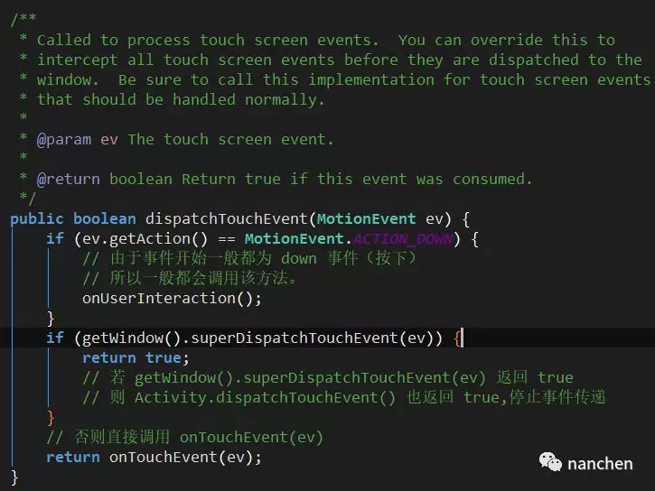
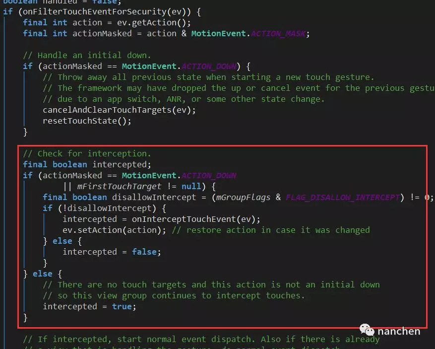
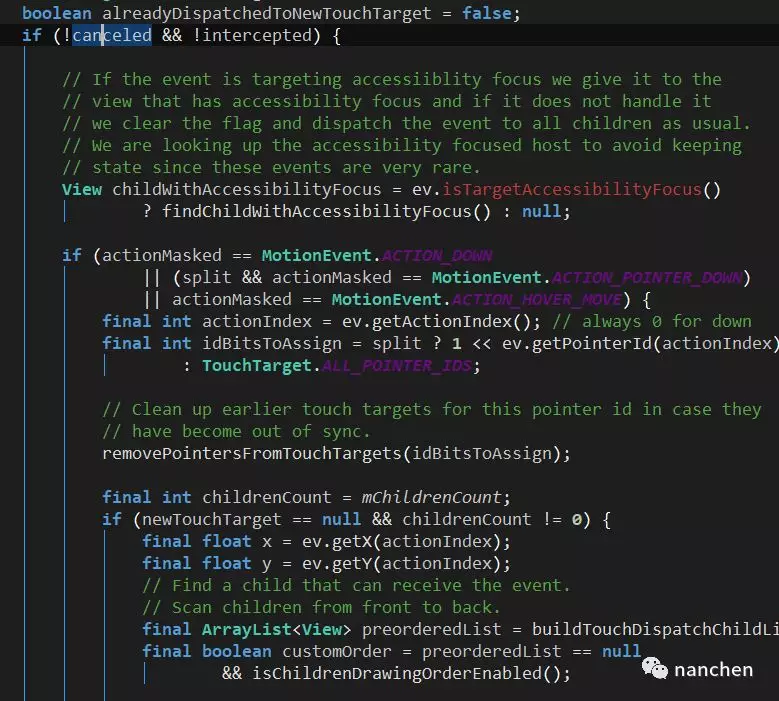
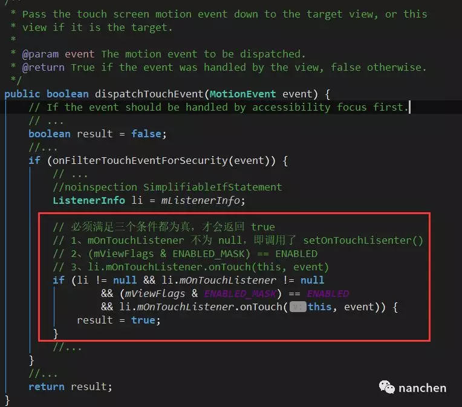
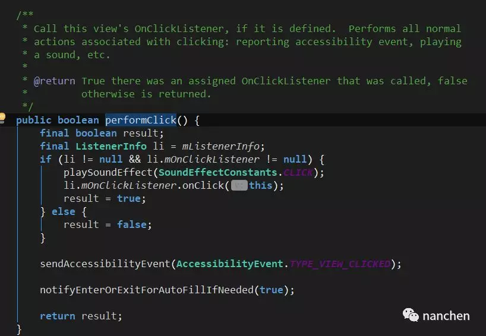
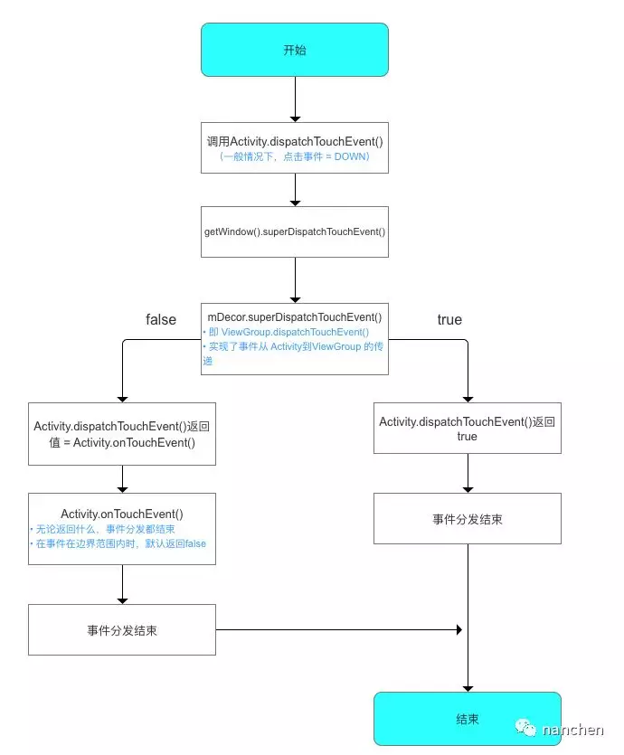
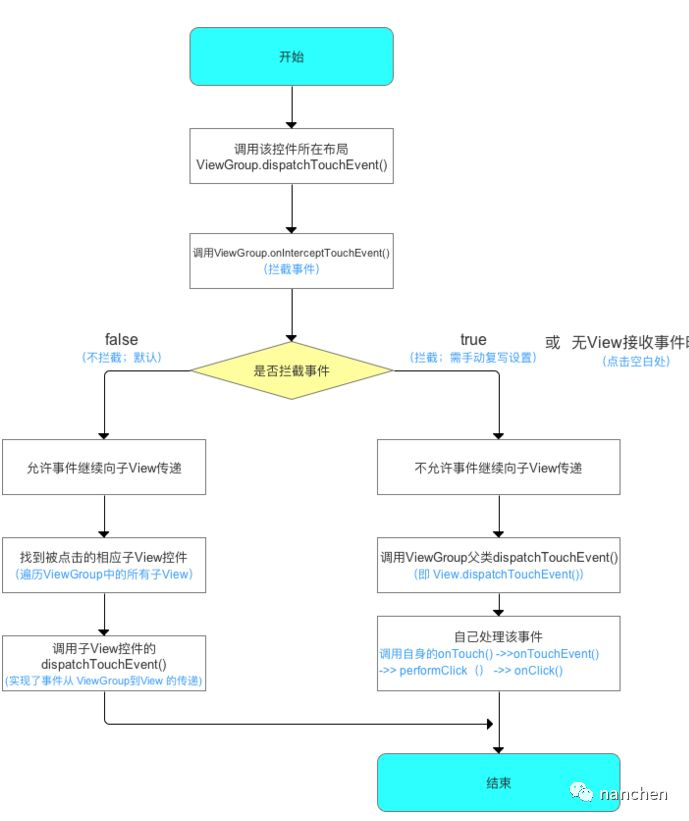
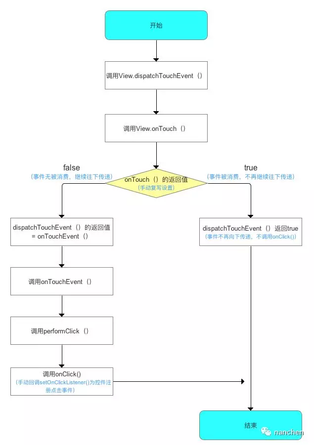
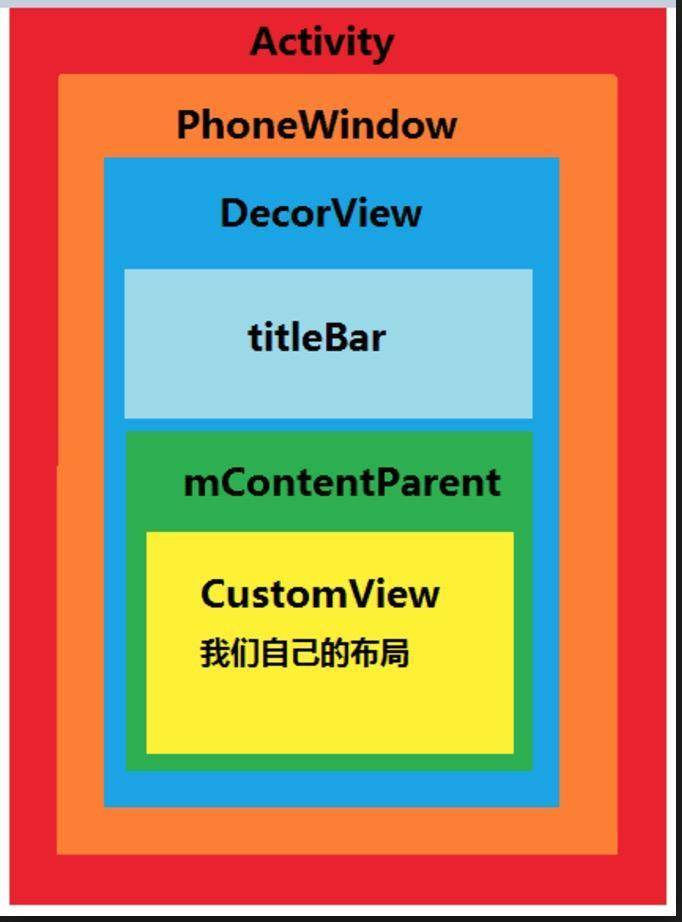
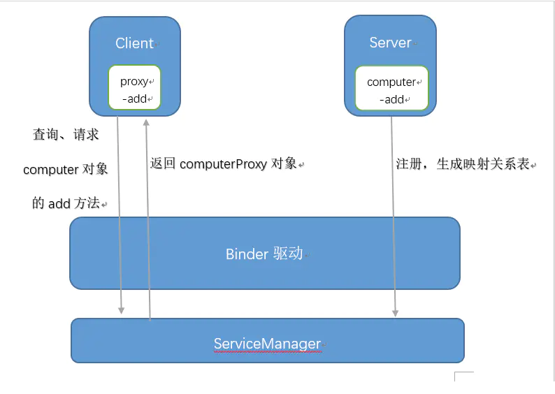

# Android相关
## 1.android事件分发机制，activity发生了点击事件，说下分发流程。Up 和 Down分发一样吗。
> 1、Android 事件分发总是遵循 Activity => ViewGroup => View 的传递顺序；
>
> 2、onTouch() 执行总优先于 onClick()

> ### Activity 的事件分发机制
> 从英文单词中已经很明显的知道，dispatchTouchEvent() 是负责事件分发的。当点击事件产生后，事件首先会传递给当前的 Activity，这会调用 Activity 的 dispatchTouchEvent() 方法，我们来看看源码中是怎么处理的。
> <div style="text-align: center"></div>
> 注意截图中，我增加了一些注释，便于我们更加方便的理解，由于我们一般产生点击事件都是MotionEvent.ACTION_DOWN，所以一般都会调用到 onUserInteraction() 这个方法。我们不妨来看看都做了什么。
> <div style="text-align: center"></div>
> 很遗憾，这个方法实现是空的，不过我们可以从注释和其他途径可以了解到，该方法主要的作用是实现屏保功能，并且当此 Activity 在栈顶的时候，触屏点击 Home、Back、Recent 键等都会触发这个方法。
> 
> 再来看看第二个 if 语句，getWindow().superDispatchTouchEvent()，getWindow() 明显是获取 Window，由于 Window 是一个抽象类，所以我们能拿到其子类 PhoneWindow，我们直接看看 PhoneWindows.superDispatchTouchEvent() 到底做了什么操作。
> <div style="text-align: center"></div>
> 直接调用了 DecorView 的 superDispatchTouchEvent() 方法。DecorView 继承于FrameLayout，作为顶层 View，是所有界面的父类。而 FrameLayout 作为 ViewGroup 的子类，所以直接调用了 ViewGroup 的 dispatchTouchEvent()。

> ### ViewGroup 的事件分发机制
> 我们通过查看 ViewGroup 的 dispatchTouchEvent() 可以发现。
> <div style="text-align: center"></div>
> 注意其中红框里面的代码，看注释也能知道，定义了一个 boolean 值变量 intercept 来表示是否要拦截事件。
>
> 其中采用到了 onInterceptTouchEvent(ev) 对 intercept 进行赋值。大多数情况下，onInterceptTouchEvent() 返回值为 false，但我们完全可以通过重写onInterceptTouchEvent(ev) 来改变它的返回值，不妨继续往下看，我们后面对这个intercept 做了什么处理。
> <div style="text-align: center"></div>
> 暂时忽略判断的 canceled，该值同样大多数时候都返回 false，所以当我们没有重写onInterceptTouchEvent() 并使它的返回值为 true 时，一般情况下都是可以进入到该方法的。
>
>继续阅读源码可以发现，里面做了一个 For 循环，通过倒序遍历 ViewGroup 下面的所有子 View，然后一个一个判断点击位置是否是该子 View 的布局区域，当然还有一些其他的，由于篇幅原因，这里就不细讲了。

> ### View 的事件分发机制
> ViewGroup 说到底还是一个 View，所以我们不得不继续看看 View 的dispatchTouchEvent()。
> <div style="text-align: center"></div>
> 截图中的代码是有删减的，我们重点看看没有删减的代码。
>
> 红框中的三个条件，第一个我就不用说了。
> 
> - (mViewFlags & ENABLED_MASK) == ENABLED
该条件是判断当前点击的控件是否为 enable，但由于基本 View 都是 enable 的，所以这个条件基本都返回 true。
>
> - mOnTouchListener.onTouch(this, event)
即我们调用 setOnTouchListener() 时必须覆盖的方法 onTouch() 的返回值。
>
> 从上述的分析，终于知道「onTouch() 方法优先级高于 onTouchEvent(event) 方法」是怎么来的了吧。
 
> ### 再来看看 onTouchEvent()
> <div style="text-align: center"></div>
> 从上面的代码可以明显地看到，只要 View 的 CLICKABLE 和 LONG_CLICKABLE 有一个为 true，那么 onTouchEvent() 就会返回 true 消耗这个事件。CLICKABLE 和 LONG_CLICKABLE 代表 View 可以被点击和长按点击，我们通常都会采用setOnClickListener() 和 setOnLongClickListener() 做设置。接着在 ACTION_UP 事件中会调用 performClick() 方法，我们看看都做了什么。
> <div style="text-align: center"></div>
> 从截图中可以看到，如果 mOnClickListener 不为空，那么它的 onClick() 方法就会调用。

总结
- Activity 的事件分发示意图
<div style="text-align: center"></div>
- ViewGroup 事件分发示意图
<div style="text-align: center"></div>
- View 的事件分发示意图
<div style="text-align: center"></div>
- 事件分发工作流程总结
<div style="text-align: center"></div>

> ### 关于ACTION_MOVE 和 ACTION_UP
>
> 当dispatchTouchEvent在进行事件分发的时候，只有前一个事件（如ACTION_DOWN）返回true，才会收到ACTION_MOVE和ACTION_UP的事件。
>
> 对于ACTION_MOVE、ACTION_UP总结：ACTION_DOWN事件在哪个控件消费了（return true）， 那么ACTION_MOVE和ACTION_UP就会从上往下（通过dispatchTouchEvent）做事件分发往下传，就只会传到这个控件，不会继续往下传，如果ACTION_DOWN事件是在dispatchTouchEvent消费，那么事件到此为止停止传递，如果ACTION_DOWN事件是在onTouchEvent消费的，那么会把ACTION_MOVE或ACTION_UP事件传给该控件的onTouchEvent处理并结束传递。


## 2. Aactivity跳转Bactivity，然后Bactivity finish后A activity显示  这个过程中的AB activity生命周期 ，时间顺序
> 一般来说流程是
> A.onPause -> B.onCrete -> B.onStart -> B.onResume -> A.onStop （仅在 B Activity 的 launchMode 为 standard 或者 B Activity 没有可复用的实例时）
> 
> 当 B Activity 的  launchMode 为 singleTop 且 B Activity 已经在栈顶时（一些特殊情况如通知栏点击、连点），此时只有 B 页面自己有生命周期变化
> B.onPause -> B.onNewIntent -> B.onResume
> 
> 当 B Activity 的  launchMode 为 singleInstance ，singleTask 且对应的 B Activity 有可复用的实例时，生命周期回调是这样的:
> A.onPause -> B.onNewIntent -> B.onRestart -> B.onStart -> B.onResume -> A.onStop -> ( 如果 A 被移出栈的话还有一个 A.onDestory)
> 
> 如果是启动一个 Theme 为 Dialog 的 Activity , 则生命周期为：
> A.onPause -> B.onCrete -> B.onStart -> B.onResume


## 3. Service两种启动方式生命周期得区别描述一下
<div style="text-align: center"></div>

> ### 通过StartService启动Service
> 通过startService启动后，service会一直无限期运行下去，只有外部调用了stopService()或stopSelf()方法时，该Service才会停止运行并销毁。
> 
> 要创建一个这样的Service，你需要让该类继承Service类，然后重写以下方法：
> - **onCreate()**
> 1.如果service没被创建过，调用startService()后会执行onCreate()回调；
> 2.如果service已处于运行中，调用startService()不会执行onCreate()方法。
也就是说，onCreate()只会在第一次创建service时候调用，多次执行startService()不会重复调用onCreate()，此方法适合完成一些初始化工作。
> - **onStartCommand()**
> 如果多次执行了Context的startService()方法，那么Service的onStartCommand()方法也会相应的多次调用。onStartCommand()方法很重要，我们在该方法中根据传入的Intent参数进行实际的操作，比如会在此处创建一个线程用于下载数据或播放音乐等。
> - **onBind()**
> Service中的onBind()方法是抽象方法，Service类本身就是抽象类，所以onBind()方法是必须重写的，即使我们用不到。
> - **onDestory()**
> 在销毁的时候会执行Service该方法。
> 
> 这几个方法都是回调方法，且在主线程中执行，由android操作系统在合适的时机调用。
> 
> **多次startService不会重复执行onCreate回调，但每次都会执行onStartCommand回调。**
> ### 通过bindService启动Service
> bindService启动服务特点：
> 1. bindService启动的服务和调用者之间是典型的client-server模式。调用者是client，service则是server端。service只有一个，但绑定到service上面的client可以有一个或很多个。这里所提到的client指的是组件，比如某个Activity。
> 2. client可以通过IBinder接口获取Service实例，从而实现在client端直接调用Service中的方法以实现灵活交互，这在通过startService方法启动中是无法实现的。
> 3. bindService启动服务的生命周期与其绑定的client息息相关。当client销毁时，client会自动与Service解除绑定。当然，client也可以明确调用Context的unbindService()方法与Service解除绑定。当没有任何client与Service绑定时，Service会自行销毁。
>
> ##### 测试步骤1
> step1: 点击ActivityA的bindService按钮
> step2: 再点击ActivityA的unbindService按钮
> ```
> 02-07 14:09:38.031 1738-1738/com.demo.kathy.demo I/Kathy: ActivityA - onCreate - Thread = main
> 02-07 14:09:39.488 1738-1738/com.demo.kathy.demo I/Kathy: ----------------------------------------------------------------------
> 02-07 14:09:39.488 1738-1738/com.demo.kathy.demo I/Kathy: ActivityA 执行 bindService
> 02-07 14:09:39.496 1738-1738/com.demo.kathy.demo I/Kathy: TestTwoService - onCreate - Thread = main
> 02-07 14:09:39.497 1738-1738/com.demo.kathy.demo I/Kathy: TestTwoService - onBind - Thread = main
> 02-07 14:09:39.500 1738-1738/com.demo.kathy.demo I/Kathy: ActivityA - onServiceConnected
> 02-07 14:09:39.500 1738-1738/com.demo.kathy.demo I/Kathy: ActivityA - getRandomNumber = -1046987376
> 02-07 14:09:50.866 1738-1738/com.demo.kathy.demo I/Kathy: ----------------------------------------------------------------------
> 02-07 14:09:50.866 1738-1738/com.demo.kathy.demo I/Kathy: ActivityA 执行 unbindService
> 02-07 14:09:50.870 1738-1738/com.demo.kathy.demo I/Kathy: TestTwoService - onUnbind - from = ActivityA
> 02-07 14:09:50.871 1738-1738/com.demo.kathy.demo I/Kathy: TestTwoService - onDestroy - Thread = main
> ```
> 
> 调用bindService之后发生的事情：
> 1. client执行bindService()
> 2. 如果Service不存在，则Service执行onCreate(),onBind()
> 3. client实例ServiceConnection执行onServiceConnected()方法
>
> 总结调用unbindService之后发生的事情:
> 1. client执行unbindService()
> 2. client与Service解除绑定连接状态
> 3. Service检测是否还有其他client与其连接，如果没有Service执行onUnbind()和onDestroy()
> 
> ##### 测试步骤2
> step1: 点击ActivityA的bindService按钮
> step2: 再点击ActivityA的Finish按钮
> ```
> 02-07 14:49:16.626 12566-12566/com.demo.kathy.demo I/Kathy: ActivityA - onCreate - Thread = main
> 02-07 14:49:18.102 12566-12566/com.demo.kathy.demo I/Kathy: ----------------------------------------------------------------------
> 02-07 14:49:18.102 12566-12566/com.demo.kathy.demo I/Kathy: ActivityA 执行 bindService
> 02-07 14:49:18.105 12566-12566/com.demo.kathy.demo I/Kathy: TestTwoService - onCreate - Thread = main
> 02-07 14:49:18.110 12566-12566/com.demo.kathy.demo I/Kathy: TestTwoService - onBind - Thread = main
> 02-07 14:49:18.112 12566-12566/com.demo.kathy.demo I/Kathy: ActivityA - onServiceConnected
> 02-07 14:49:18.112 12566-12566/com.demo.kathy.demo I/Kathy: ActivityA - getRandomNumber = -318399886
> 02-07 14:49:19.540 12566-12566/com.demo.kathy.demo I/Kathy: ----------------------------------------------------------------------
> 02-07 14:49:19.540 12566-12566/com.demo.kathy.demo I/Kathy: ActivityA 执行 finish
> 02-07 14:49:19.789 12566-12566/com.demo.kathy.demo I/Kathy: ActivityA - onDestroy
> 02-07 14:49:19.798 12566-12566/com.demo.kathy.demo I/Kathy: TestTwoService - onUnbind - from = ActivityA
> 02-07 14:49:19.798 12566-12566/com.demo.kathy.demo I/Kathy: TestTwoService - onDestroy - Thread = main
> ```
> 
> 总结：如果client销毁，那么client会自动与Service解除绑定。
> 
> ##### 测试步骤3
> step1: 点击ActivityA的bindService按钮
step2: 点击ActivityA的startActivity B按钮，切换到ActivityB
step3: 点击ActivityB中的bindService按钮
step4: 点击ActivityB中的unbindService按钮
step5: 点击ActivityB中的Finish按钮
> step6: 点击ActivityA中的unbindService按钮
> ```
> 02-07 14:55:04.390 12566-12566/com.demo.kathy.demo I/Kathy: ActivityA - onCreate - Thread = main
> 02-07 14:55:08.191 12566-12566/com.demo.kathy.demo I/Kathy: ----------------------------------------------------------------------
> 02-07 14:55:08.191 12566-12566/com.demo.kathy.demo I/Kathy: ActivityA 执行 bindService
> 02-07 14:55:08.197 12566-12566/com.demo.kathy.demo I/Kathy: TestTwoService - onCreate - Thread = main
> 02-07 14:55:08.198 12566-12566/com.demo.kathy.demo I/Kathy: TestTwoService - onBind - Thread = main
> 02-07 14:55:08.205 12566-12566/com.demo.kathy.demo I/Kathy: ActivityA - onServiceConnected
> 02-07 14:55:08.205 12566-12566/com.demo.kathy.demo I/Kathy: ActivityA - getRandomNumber = -706215542
> 02-07 14:55:23.261 12566-12566/com.demo.kathy.demo I/Kathy: ----------------------------------------------------------------------
> 02-07 14:55:23.261 12566-12566/com.demo.kathy.demo I/Kathy: ActivityA 启动 ActivityB
> 02-07 14:55:29.239 12566-12566/com.demo.kathy.demo I/Kathy: ----------------------------------------------------------------------
> 02-07 14:55:29.239 12566-12566/com.demo.kathy.demo I/Kathy: ActivityB 执行 bindService
> 02-07 14:55:29.241 12566-12566/com.demo.kathy.demo I/Kathy: ActivityB - onServiceConnected
> 02-07 14:55:29.241 12566-12566/com.demo.kathy.demo I/Kathy: ActivityB - getRandomNumber = 1827572726
> 02-07 14:55:33.951 12566-12566/com.demo.kathy.demo I/Kathy: ----------------------------------------------------------------------
> 02-07 14:55:33.951 12566-12566/com.demo.kathy.demo I/Kathy: ActivityB 执行 unbindService
> 02-07 14:55:36.645 12566-12566/com.demo.kathy.demo I/Kathy: ----------------------------------------------------------------------
> 02-07 14:55:36.645 12566-12566/com.demo.kathy.demo I/Kathy: ActivityB 执行 finish
> 02-07 14:55:36.852 12566-12566/com.demo.kathy.demo I/Kathy: ActivityB - onDestroy
> 02-07 14:55:43.137 12566-12566/com.demo.kathy.demo I/Kathy: ----------------------------------------------------------------------
> 02-07 14:55:43.137 12566-12566/com.demo.kathy.demo I/Kathy: ActivityA 执行 unbindService
> 02-07 14:55:43.143 12566-12566/com.demo.kathy.demo I/Kathy: TestTwoService - onUnbind - from = ActivityA
> 02-07 14:55:43.143 12566-12566/com.demo.kathy.demo I/Kathy: TestTwoService - onDestroy - Thread = main
> ```
> 总结bindService的生命周期：
> 1. 点击ActivityA的bindService按钮
> 第一次调用bindService会实例化TestTwoService，然后执行其onBind()方法，得到IBinder类型的实例，将其作为参数传入ActivityA的ServiceConnection的onServiceConnected方法中，标志着ActivityA与TestTwoService建立了绑定。
> 2. 点击ActivityB中的bindService按钮
> 由于TestTwoService已处于运行状态，所以再次调用bindService不会重新创建它的实例，所以也不会执行TestTwoService的onCreate()方法和onBind()方法。ActivityB与ActivityA共享IBinder实例。此时有两个client与TestTwoService绑定。
> 3. 点击ActivityB中的unbindService按钮
> ActivityB与TestTwoService解除了绑定，当没有任何client与Service绑定时，才会执行Service的onUnbind()方法。此时，ActivityA还在绑定连接中，所以不会执行Service的解绑方法。
> 4. 点击ActivityA中的unbindService按钮
> ActivityA执行unbindService之后，ActivityA与TestTwoService就解除绑定了，这样就没有client与TestTwoService绑定，这时候Android会销毁TestTwoService，在销毁前会先执行TestTwoService的onUnbind()方法，然后才会执行其onDestroy()方法，这样TestService就销毁了。


## activity四种launchmode
> **standard模式** 这是默认模式，每次激活Activity时都会创建Activity实例，并放入任务栈中。使用场景：大多数Activity。
>
> **singleTop模式** 如果在任务的栈顶正好存在该Activity的实例，就重用该实例( 会调用实例的 onNewIntent() )，否则就会创建新的实例并放入栈顶，即使栈中已经存在该Activity的实例，只要不在栈顶，都会创建新的实例。使用场景如新闻类或者阅读类App的内容页面。
>
> **singleTask模式** 如果在栈中已经有该Activity的实例，就重用该实例(会调用实例的 onNewIntent() )。重用时，会让该实例回到栈顶，因此在它上面的实例将会被移出栈。如果栈中不存在该实例，将会创建新的实例放入栈中。使用场景如浏览器的主界面。不管从多少个应用启动浏览器，只会启动主界面一次，其余情况都会走onNewIntent，并且会清空主界面上面的其他页面。
>
> **singleInstance模式** 在一个新栈中创建该Activity的实例，并让多个应用共享该栈中的该Activity实例。一旦该模式的Activity实例已经存在于某个栈中，任何应用再激活该Activity时都会重用该栈中的实例( 会调用实例的 onNewIntent() )。其效果相当于多个应用共享一个应用，不管谁激活该 Activity 都会进入同一个应用中。使用场景如闹铃提醒，将闹铃提醒与闹铃设置分离。singleInstance不要用于中间页面，如果用于中间页面，跳转会有问题，比如：A -> B (singleInstance) -> C，完全退出后，在此启动，首先打开的是B。


## activity，view和window之间的关系
> ### 什么是activity,view，window？
> - Activity是四大组件之一，也是界面的载体可以显示界面；
> - View则是一个个的视图，搭载在layout上，通过activity的setContentView()方法传递给Activity；
> - Window是一个窗体，每个Activity对应一个Window，通常在代码中用getWindow()方法获取；
> #### 三者之间的关系？
> Activity像是个工匠（承载单元），Window像是窗户（承载模型），View像是窗花（显示视图），LayoutInflater像是剪刀，XML配置像是窗花图纸。
> <div style="text-align: center"></div>
> #### Window是什么？
> Activity管理View是通过Window间接管理的。Window通过addView(),removeView(),updateViewLayout()这三个方法来管理的。


## Android系统启动过程
> ### 系统上电
> 当给Android系统上电，CPU复位之后，程序指针会指向启动地址，从该地址读取启动程序的可执行代码直接运行，或者将可执行代码与数据载入CPU内置的RAM中再运行。
> CPU复位就是指在电源接通的瞬间，CPU内的寄存器和各引脚均会被置为初始状态，并将程序指向引导程序的位置。
> 这一段代码在PC中叫BIOS，在Android中叫Bootloader。
> ### Bootloader引导程序
> 通过Bootloader引导程序，可以初始化硬件设备，建立内存空间映射图，为操作系统内核准备好环境，完成整个系统的加载启动任务。
> Bootloader是支持交互式操作的，一般刷机中会用到的Fastboot模式，就是在Bootloader启动之后，根据用户输入的指令(在手机上用音量键，Home等操作)，停留在当前状态。
> 正常情况下Bootloader执行完成后，就会开始加载Android系统。
> ### 加载内核
> 当Bootloader引导程序启动之后，就会进入Linux的内核引导阶段。
> 引导阶段就会初始化内核和设备驱动，接着启动内核，挂在文件系统，最后启动用户空间进程。
> ### Init程序
> Init是用户空间的第一个进程。它负责解析一个叫init.rc的配置文件，启动Android系统底层运行的一些服务进程。init.rc定义了不同的Action和Service，其格式如下
> > #### Action
> > ```
> > on boot
> >     ...
> >     class_start core
> >     class_start main
> > ```
> > Action是以关键字on来定义的，紧接着的boot是一个触发条件，如上面的action表明当Android启动的时候，要做什么事。
> > #### Service
> > ```
> > service servicemanager /system/bin/servicemanager #声明一个service,而servicemanager则是其名字
> >     class core                          #optioin, 该service属于core类
> >     user system                         $option,该service属于System用户
> >     group System
> > ```
> > Service是以关键字service来定义的，紧跟着是其名字和启动文件，如上会执行/system/bin/servicemanager文件，并将其命名为servicemanager。
> >
> > 如上，Action boot之后的class_start core等，是init程序在开机时会启动的服务。
> > 这些服务包括ueventd，servicemanager,void,zygote,installed,ril-daemon等，我们一般称他们是守护进程。
> > Init程序同时也会开启属性服务，存放一些关于Android系统的全局系统属性设置信息。
> > 最后，当Action和Service都启动完成之后，Init程序会进入一个死循环，监听系统发生的事件，对一些事件进行处理，比如重启某些服务等。
> > #### ServiceManager
> > ServiceManager是Init程序启动的守护进程之一，它是Android中Binder通信的基础。
> > ServiceManager提供了注册，检索服务的功能。在zygote子进程system_server启动的每一项服务都会将其注册到ServiceManager中，由ServiceManager来统一进行管理。值得注意的是由于ServiceManager本身也是一个Service，所以它也会将自己注册到自身上面。
> > ServiceManager启动的过程做了三件事：
> > > 1. 打开Binder设备，把Binder设备映射到内核空间中，由于内核空间是所有进程共享的区域，所以借助这块区域，可以实现不同进程间资源的共享，从而达到进程间通信。
> > > 2. ServiceManager本身会变成一个ContextManager，即上面所说的注册到自己身上，负责各种Service的上下文管理。
> > > 3. 最终ServiceManager也是会进入一个无限循环。
> #### Zygote
> > Zygote是由Init程序启动的某一个服务，但它却是Android世界中第一个Dalvik虚拟机。在那之后，所有的Dalvik虚拟机全是由Zygote孵化出来的，这是因为Android每一个应用都有自己的进程，而每一个进程都有Dalvik虚拟机，如果每一个应用就创建一个虚拟机，效率太低，而通过复制Zygote，不仅可以提高创建的速度，还能够共享系统和框架资源，可以大幅度提高应用程序启动的速度。
> > > ##### Zygote创建之后
> > > 1. 首先会创建一个socket，等待某个客户端的请求。
> > > 2. 接着创建一个子进程，叫做system_server。*system_server会开启Android系统的Native Service和Java Service。其中Native Service就是那些利用JNI实现的共享库，而Java Service则是通过Java语言实现的ActivityManagerService等，都是在这个阶段由system_server启动并注册到一个叫ServiceManager的服务进程中。*
> > > ActivityManagerService启动后,会进入到一个叫System Ready的状态，而其达到System Ready的状态，而在到达System Ready的状态之前会启动一个叫Launcher的应用，而这个Launcher就是Android系统启动成功后见到的Home桌面。
> > > 而在System Ready状态，其会跟Zygote启动之初的Socket进行通信，告诉Zygote，一切已就绪。
> > > 3. Zygote知道自己启动成功之后，就开始进入一个无限循环，在Socket上等待请求的到来。


#### [Looper 死循环为什么不会导致应用卡死，会消耗大量资源吗？](https://zhuanlan.zhihu.com/p/73690640)
> binder线程采用死循环的方式，通过循环方式不同与Binder驱动进行读写操作，当然并非简单的死循环，无消息时会休眠。但是这里又引发了一个新问题，既然死循环又是如何处理其他事物的呢，通过创建新线程的方式。真正会卡死主线程的地方是在回调方法onCreate(),onStart(),onResume()等操作时间过长，会导致掉帧，甚至发生ANR，looper.loop本身不会导致应用卡死。
#### 主线程的死循环一直运行是不是特别消耗CPU资源
> 在主线程的MessageQueue没有消息时，便阻塞在loop的queue.next()中的nativePollOnce()方法中，此时主线程会释放CPU资源进入休眠状态，直到下个消息到达或者有事物发生，通过往pipe管道写端写数据来唤醒主线程工作。这里采用的epoll机制，是一种IO多路复用的机制，可以同时监控多个描述符，当某个描述符就绪(读或写就绪)，则立刻通知相应操作符进行读或者写操作，本质同步I/O，即读写是阻塞的。所以说，主线程大部分时间都是处于休眠状态，并不会消耗大量CPU资源。
#### 主线程的消息循环机制是什么
> Activity的生命周期都是依靠主线程的Looper.loop(),当收到不同Message时则采用相应措施:一旦退出消息循环，那么你的程序也可以退出了。从消息队列中取消息可能会引起阻塞，取到的消息做响应处理。如果某个消息的处理时间过长，就会影响UI线程的刷新速率，造成卡顿现象。
> thread.attach(false)方法函数中便会创建一个Binder线程(具体是ApplicationThread，Binder的服务端，用于接收系统服务AMS发送来的事件)，该Binder线程通过Handler将Message发送给主线程。「Activity的启动过程」
> 比如收到msg=H.LAUNCH_ACTIVITY,则调用ActivityThread.handleLaunchActivity()方法，最终会通过反射机制，创建Activity实例，然后在执行Activity.onCreate()方法。
> 再比如收到msg=H.PAUSE_ACTIVITY，则调用ActivityThread.handlePauseActivity()方法，最终会执行Activity.onPause()等方法。
> > ##### system_server进程
> > system_server进程是系统进程，java framework框架的核心载体，里面运行了大量的系统服务，比如这里提供的ApplicationThreadProxy(简称ATP)，ActivityManagerService(简称AMS)，这个两个服务都是运行在system_server进程的不同线程中，犹豫ATP和AMS都是基于IBinder接口，都是binder线程，binder线程的创建与销毁都是由binder驱动来决定的。
> > ##### App进程
> > App进程则是我们常说的应用程序，主线程主要负责Activity/Service等组件的生命周期以及UI相关操作都运行在这个线程；另外，每个App进程中至少会有两个binder线程ApplicationThread(简称AT)和ActivityManagerProxy(简称AMP，除了图中画的线程，其中还有很多线程)
> > ##### Binder
> > Binder用于不痛进程之间的通信，由一个进程的Binder客户端想另一个进程的服务端发送事物，比如图中线程2向线程4发送事物；而handler用于在同一个进程中不同线程的通信，比如图中线程4向主线程发送消息。
> > <div style="text-align: center"></div> 
> > 结合图说说Activity生命周期，比如暂停Activity，流程如下：
> > 1. 线程1的AMS中调用线程2的ATP；（由于同一个进程的线程间资源共享，可以相互直接调用，但需要注意多线程并发的问题）
> > 2. 线程2通过binder传输到App进程的线程4；
> > 3. 线程4通过handler消息机制，将暂停Activity的消息发送给主线程；
> > 4. 主线程在Looper.loop（）中循环遍历消息，当收到暂停Activity的消息时，便将消息分发给ActivityThread.H.handeMessage()方法
> > 5. 最后变回调用到Activity.onPause()，当onPause()处理完后，继续循环loop下去。
> >
> > **补充：**
> > > ActivityThread的main方法主要就是做消息循环，一旦退出消息循环，那么你的程序也就可以退出了。
> > > 从消息队列中取消息可能会阻塞，取到消息会做出相应的处理。如果某个消息处理时间过长，就可能会影响UI线程的刷新速率，造成卡顿的现象。
> >
> > 最后通过《Android开发艺术探索》的一段话总结：
> > > ActivityThread通过ApplicationThread和AMS进行进程间通讯，AMS以进程间通信的方式完成ActivityThread的请求后回调ApplicationThread中的Binder方法，然后ApplicationThread会向H发送消息，H收到消息后会将ApplicationThread中的逻辑切换到ActivityThread中去执行，即切换到主线程中去执行，这个过程就是主线程的消息循环模型。
#### ActivityThread的动力是什么
> **进程：** 每个app运行时前首先创建一个进程，改进程是由Zygote fork出来的，用于承载App上运行的各种Activity/Service等组件。进程对于上层应用来说是完全透明的，这又是google有意为之，让App程序都是运行在Android Runtime。大多数去年概况一个App就运行在一个进程中，除非在AndroidManifest.xml中配置Android:process属性，或者通过native代码fork进程。
> **线程：** 线程对应用来说非常常见，比如每次new Thread().start()都会创建一个新的线程。该线程与App所在进程之间资源共享，从Linux角度来说进程与线程除了是否共享资源外，并没有本质的区别，都是一个task_struct结构提，在CPU看来进程或线程无非就是一段可执行的代码，CPU采用CFS调度算法，保证每个task都尽可能公平的享有CPU时间片。
> 其实承载ActivityThread的主线程就是由Zygote fork而创建的进程。


## Binder
> ### 为什么使用Binder
>> 1. **性能方面**
>> 广泛的使用跨进程通讯对通信机制的性能有严格要求，Binder相对于传统的Socket方式更加高效。Binder数据拷贝只需要一次，而管道，消息队列，Socket都需要两次拷贝。内存共享一次拷贝都不需要，但是内存共享的实现方式比较复杂。
>> 2. **安全方面**
>> 传统的进程通信方式对通信双方的身份并没有做出严格的验证，比如Socket通信ip地址是客户端手动填入，很容易进行伪造，而Binder机制从协议本身就支持对通信双方做身份校验，因而提高安全性。
> ### 什么是Binder
>> 1. 通常意义下，Binder是一种通信机制。
>> 2. 对于Server进程来说，Binder指的是Binder本地对象/对于Client来说，Binder是指Binder代理对象。
>> 3. 对于传输过程而言，Binder是可以进行跨进程传递的对象。
> ### Binder通信模型
>> Binder通信有四个角色,分别是Client进程，Server进程，ServiceManager,和Binder驱动。
>>
>> <div style="text-align: center"></div>
>>
>> Service进程向ServiceManager进程注册服务(可访问的方法接口)，Client进程通过Binder驱动可以访问到Server进程提供的服务。Binder驱动管理着Binder之间的数据传递，这个数据的具体格式由Binder协议定义(可以类比网络传输的TCP协议)。并且Binder驱动持有每个Server在内核中的Binder实体，并给Client提供Binder服务。
>>
>> 不管是Server进程注册，还是Client查询，都是经过Binder驱动的
>> 
>> - Binder跨进程传输并不是真的把一个对象传输到了另一个进程；传输过程好像是Binder跨进程穿越的时候，它在一个进程留下的一个真身，在另一个进程留下了影子(这个影子可以有很多个)；Client进程的操作其实是对影子的操作，影子利用Binder驱动最终让真身完成操作。
> ### Binder线程管理
> 每个Binder的Server进程都会创建很多线程来处理Binder，但是真正管理这些线程的是由Binder驱动管理的。
>
> 一个进程的Binder线程数默认最大是16,超过的请求会被阻塞等待空闲的Binder线程。
> ### bind通信机制原理
> <div style="text-align: center"></div>
> 
> 1. 每一个提供服务的Server都会通过Binder驱动，将自身给注册到ServiceManager中，方便众多想获取服务的Client可以去ServiceManager找到自己。
> 2. 这些Service都会经过内核空间的Binder驱动，其实这个"经过"的说法，本质上，就是Server们会将自身作为一个对象，封装在数据包中，将这些数据复制到内核空间中，由Binder驱动访问。
> 3. 而Binder驱动读取数据包的时候，如果发现其中有Binder实体，类似ServiceManager那样的服务提供商，那么也会为对应的Binder实体创建对应的Binder节点（BinderNode）。这些节点位于Server所属的进程内。
> 4. Binder驱动也会为这些服务分配句柄（大于0），同时会将这些句柄也记录在Binder驱动中，然后再将这些句柄和名字发送给ServiceManager，由ServiceManager来维护。
> ### Binder驱动是什么
> Binder驱动和硬件没有什么关系，他就是一段运行在内核空间的代码，通过一个名叫"/dev/binder"的文件在内核空间和用户空间来回搬运数据。
> 

### RecyclerView加载大量图片如何避免oom，同时保证滑动查看时流畅
> 1. 降低图片的色彩解析模式，比如 glide 默认使用 RGB_565,内存直接减少一半
> 2. 对于网络图片可以通过 cdn 云平台按需加载，比如腾讯云 cdn 可以在图片 url 后面拼接参数，界面上只加载所需要的大小质量的图片
> 3. 高效的图片缓存，LRU 缓存，Glide 的多尺寸缓存等
> 4. 高效的处理 Bitmap【bitmap 的复用和主动回收】
> 5. 如果大图片有预览功能，还可以使用 BitmapRegionDecoder 切片和手势，可以优化超大图片
> 6. 加载图片使用 http2.0
> 7. 加载 webp 格式的图片
> 8. 本地的图片等资源，要放置在合理的分辨率目录下面
> 9. 对于某一些图片可以预加载
> 10. 滑动列表的停止加载图片，停止的时候继续加载
> 11. 安卓 5.0 以下的手机，可以使用 Fresco，他将图片数据放在 native 堆里面，目前 8.0 以后都是放在 native 堆里面，可以有效减少 oom
> 12. 图片加载和页面的生命周期绑定，glide 有这个功能
> 13. 内存不足的时候，清除内存缓存
> 14. 对于本地大图片，先进行压缩