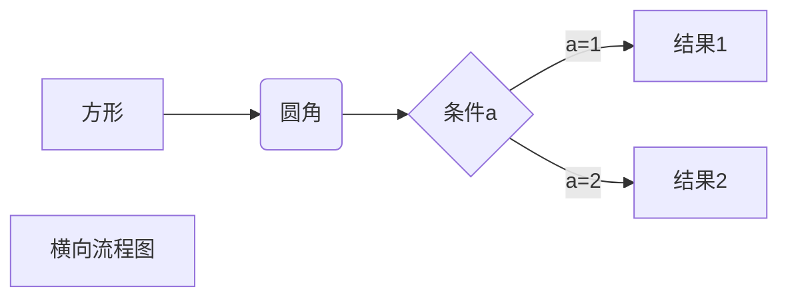
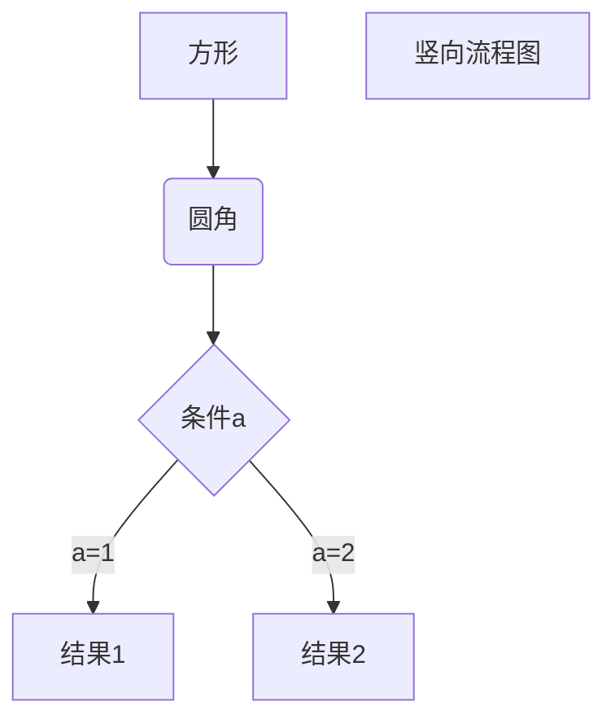
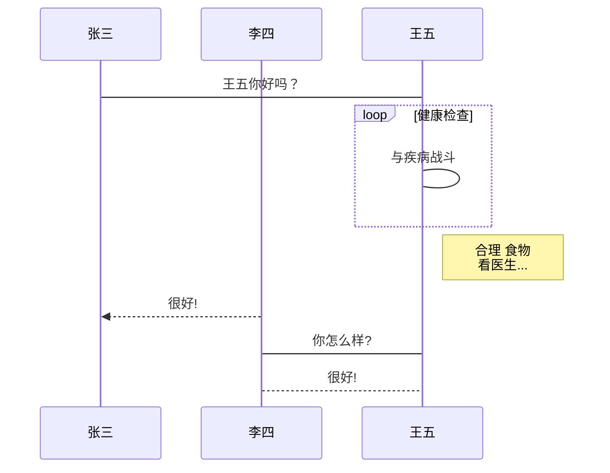
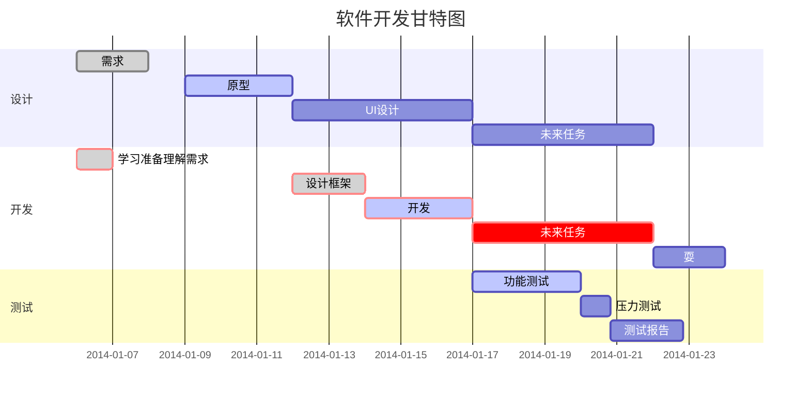
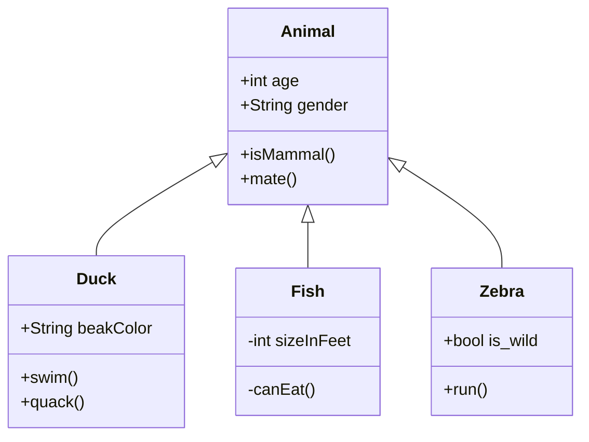
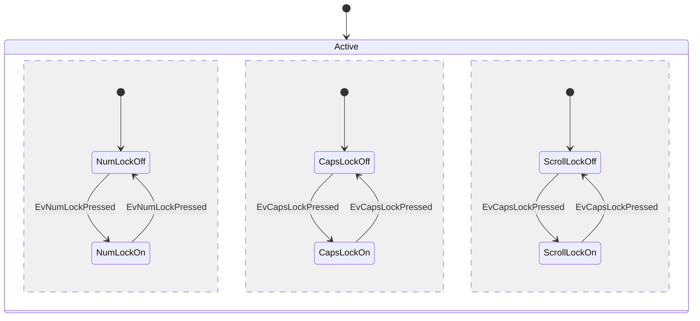
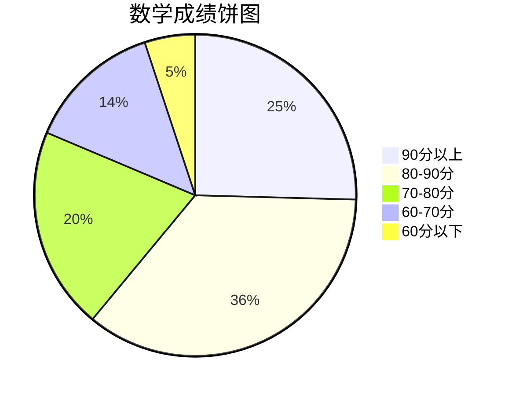
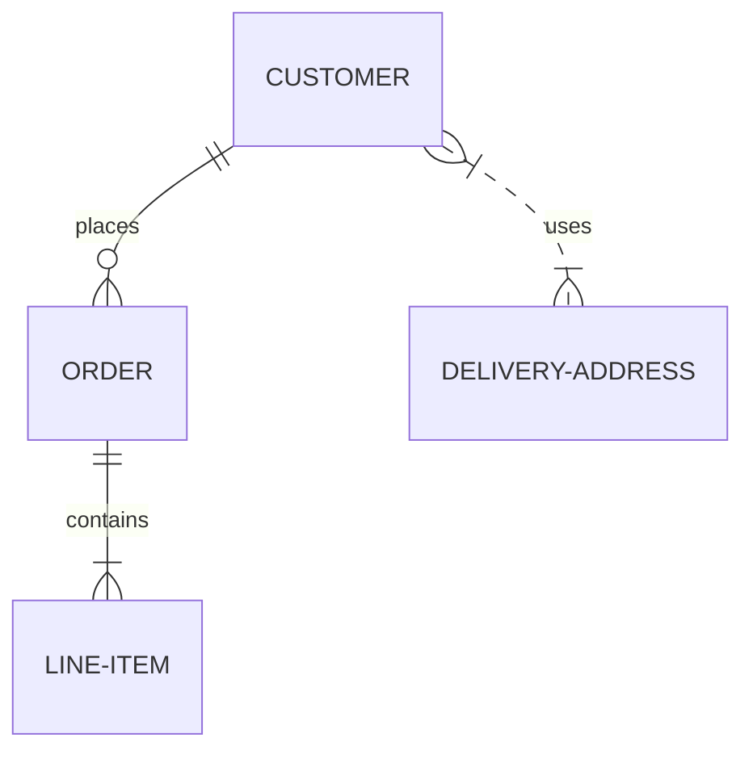
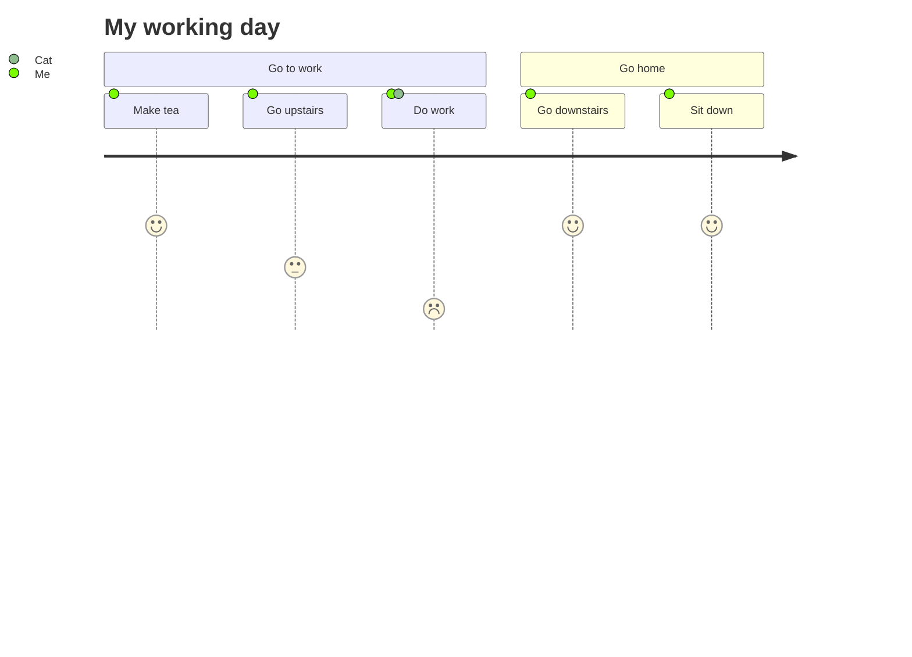

# Markdown不常用的语法

- [Markdown不常用的语法](#markdown不常用的语法)
  - [任务清单](#任务清单)
  - [HTML元素](#html元素)
  - [公式](#公式)
  - [Mermaid图](#mermaid图)
    - [横向流程图](#横向流程图)
    - [竖向流程图](#竖向流程图)
    - [标准流程图](#标准流程图)
    - [横向标准流程图](#横向标准流程图)
    - [UML时序图](#uml时序图)
    - [UML时序图源码复杂样例](#uml时序图源码复杂样例)
    - [UML标准时序图样例](#uml标准时序图样例)
    - [甘特图样例](#甘特图样例)
    - [类图](#类图)
    - [状态迁移图](#状态迁移图)
    - [饼图](#饼图)
    - [Git log图（虽然官网有示例，但是有问题，也没有对应文档）](#git-log图虽然官网有示例但是有问题也没有对应文档)
    - [整体关系图](#整体关系图)
    - [行程图](#行程图)

## 任务清单
```
- [x] 支持 @提到某人、#引用、[链接]()、**格式化** 和 <del>标签</del> 等语法
- [x] 需要使用列表语法来激活（无序或有序列表均可）
- [x] 这是一个已完成项目
- [ ] 这是一个未完成项目
```
效果
- [x] 支持 @提到某人、#引用、[链接]()、**格式化** 和 <del>标签</del> 等语法
- [x] 需要使用列表语法来激活（无序或有序列表均可）
- [x] 这是一个已完成项目
- [ ] 这是一个未完成项目

## HTML元素
`使用 <kbd>Ctrl</kbd>+<kbd>Alt</kbd>+<kbd>Del</kbd> 重启电脑`
效果
使用 <kbd>Ctrl</kbd>+<kbd>Alt</kbd>+<kbd>Del</kbd> 重启电脑

## 公式
当你需要在编辑器中插入数学公式时，可以使用两个美元符 $$ 包裹 TeX 或 LaTeX 格式的数学公式来实现。提交后，问答和文章页会根据需要加载 Mathjax 对数学公式进行渲染。
```latex
$$ 
xy \text{ with arrows:} \quad \overleftarrow{xy} \; \mid \; \overleftrightarrow{xy} \; \mid \; \overrightarrow{xy} 
$$

$$ \int_0^1 {x^2} \,{\rm d}x $$
```
效果
$$ 
xy \text{ with arrows:} \quad \overleftarrow{xy} \; \mid \; \overleftrightarrow{xy} \; \mid \; \overrightarrow{xy} 
$$

$$ \int_0^1 {x^2} \,{\rm d}x $$

## Mermaid图
官网示例：[https://mermaid-js.github.io/mermaid/#/](https://mermaid-js.github.io/mermaid/#/)
### 横向流程图
mermaid语法: [https://cloud.tencent.com/developer/article/1334691](https://cloud.tencent.com/developer/article/1334691)


### 竖向流程图


### 标准流程图
flow语法：[https://www.jianshu.com/p/f28c94cf1204](https://www.jianshu.com/p/f28c94cf1204)
```flow
st=>start: 开始框
op=>operation: 处理框
cond=>condition: 判断框(是或否?)
sub1=>subroutine: 子流程
io=>inputoutput: 输入输出框
e=>end: 结束框

st->op->cond
cond(yes)->io->e
cond(no)->sub1(right)->op
```

### 横向标准流程图
```flow
st=>start: 开始框
op=>operation: 处理框
cond=>condition: 判断框(是或否?)
sub1=>subroutine: 子流程
io=>inputoutput: 输入输出框
e=>end: 结束框

st(right)->op->cond
cond(yes)->io(bottom)->e
cond(no)->sub1(top)->op
```

### UML时序图
```sequence
对象A->对象B: 对象B你好吗?（请求）
Note right of 对象B: 对象B的描述
Note left of 对象A: 对象A的描述(提示)
对象B-->对象A: 我很好(响应)
对象A->对象B: 你真的好吗？
```

### UML时序图源码复杂样例
```sequence
Title: 标题：复杂使用
对象A->对象B: 对象B你好吗?（请求）
Note right of 对象B: 对象B的描述
Note left of 对象A: 对象A的描述(提示)
对象B-->对象A: 我很好(响应)
对象B->小三: 你好吗
小三-->>对象A: 对象B找我了
对象A->对象B: 你真的好吗？
Note over 小三,对象B: 我们是朋友
participant C
Note right of C: 没人陪我玩
```

### UML标准时序图样例


### 甘特图样例


### 类图


### 状态迁移图


### 饼图


### Git log图（虽然官网有示例，但是有问题，也没有对应文档）


### 整体关系图


### 行程图
